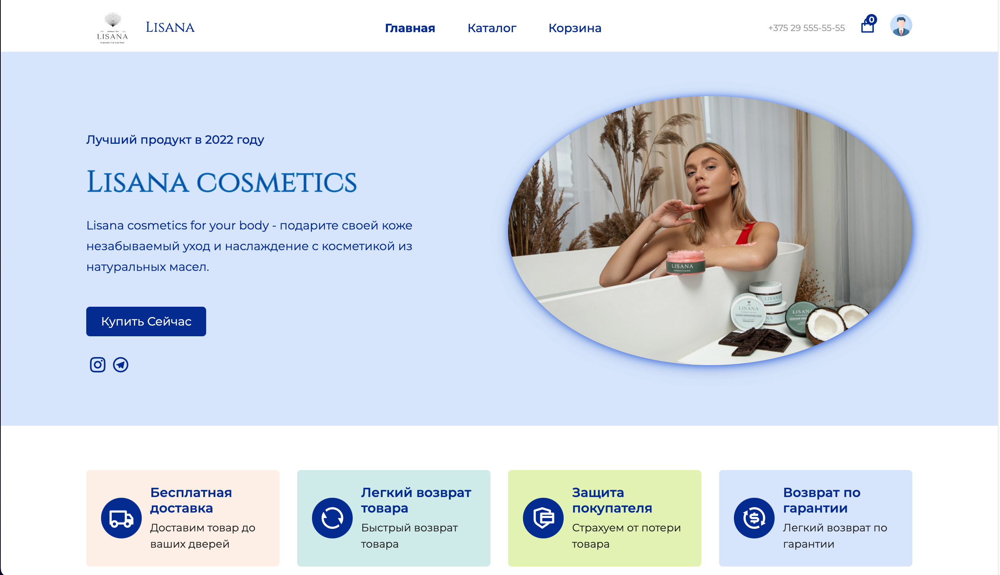
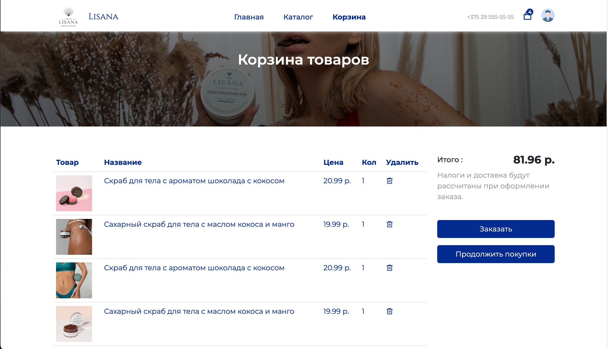
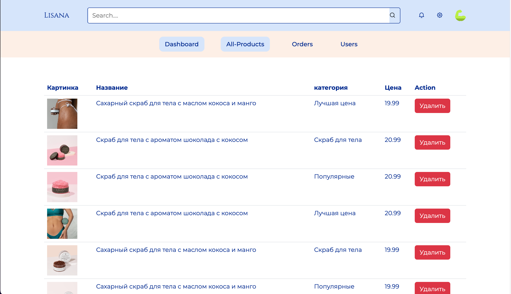
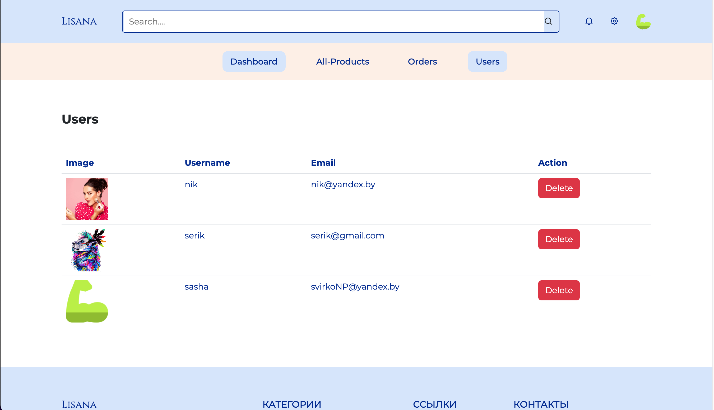
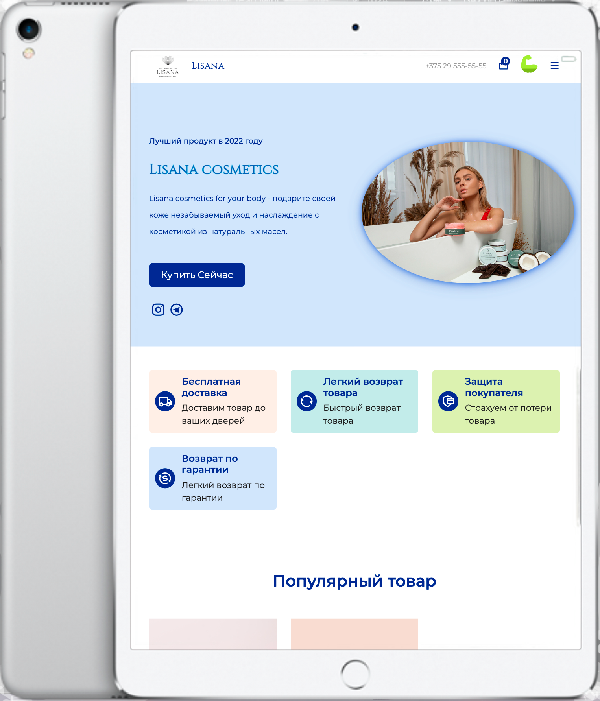

## Lisana E-Commerce Title

      

 

 
## Lisana Shop 💰  

      

## Lisana Cart 🛒    

      

## Lisana Dashboard 💻    

      

## Lisana Users 👨🏼‍💼    

      

## Other Devices 📱

      
      

   
   
   

## Описание

Создание и развёртка интернет-магазина косметики Lisana. Использование современных технологий веб-разработки React Redux Toolkit FireBase. Смотрите другие мои работы!

## Запросы клиента

Клиент попросил разработать интернет-магазин с панелью администратора для самостоятельного пополнения товаров и контроля пользователей. Для Back-end я использовал Redux и Firebase для реализации регистрации и админ-панели. 

## Description

Creation and deployment of an online cosmetics store Lisana. Using modern web development technologies React Redux Toolkit FireBase. See my other works!

## Requests

The client asked to develop an online store with an admin panel for self-replenishment of goods and user control. For the Back-end, I used Redux and Firebase to implement the registration and admin panel.

## View Work

- 👀 
View site https://react-kx4ejk678-svirkonp-yandexby.vercel.app/home

## 💻 Developer

- [SvirkoAlexander](https://github.com/SvirkoAlexander)

## License 

Project is distributed under the MIT License.
